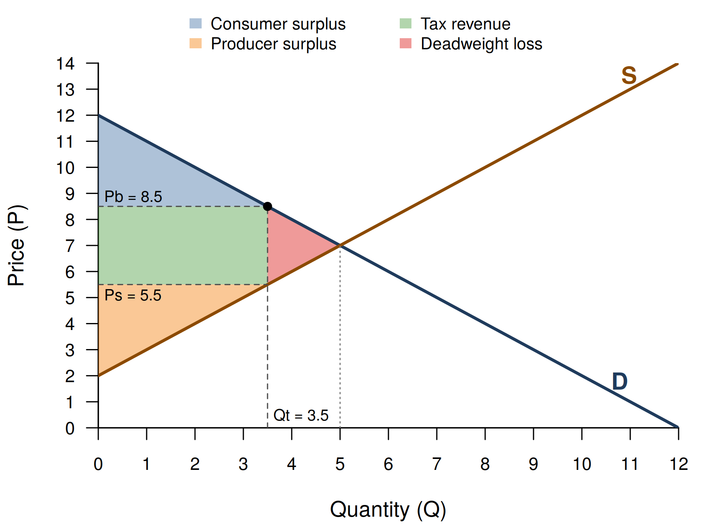

<!--
  NOTE FOR MAINTENANCE (this comment is not shown on the website)
  - The static picture below is made by code/tutorial01_figures.R (run
    code/master.R in RStudio; Part 3 makes the Tutorial 1 figures).
  - The interactive app further down is a {shinylive-r} chunk. Shinylive apps
    must be self-contained, so the chunk contains two "files":
      app.R               - the user interface and server (written here)
      functions_models.R  - pulled in from ../code/functions_models.R by
                            Quarto's include shortcode when the site is
                            rendered, so the app always uses the same model
                            code as the handout figures.
  - To try the app on your computer as a normal Shiny app before pushing,
    switch on Part 14 (code/app_test.R) in code/master.R.
-->

## The idea in plain language

**Demand.** Buyers differ in how much they are willing to pay. Line them up from the keenest to the least keen and you get the *demand curve*: the lower the price, the more units are bought. In our model, demand is a straight line, $P = a - bQ$. The intercept $a$ is the highest price anyone would pay; the slope $b$ says how quickly willingness to pay falls.

**Supply.** Sellers differ in their costs. Line them up from cheapest to most expensive and you get the *supply curve*: the higher the price, the more units are offered. Here supply is $P = c + dQ$, where $c$ is the cost of the cheapest seller.

**Equilibrium.** The market settles where the two lines cross: the price at which the quantity buyers want equals the quantity sellers offer.

**Who gains from trade?**

- *Consumer surplus (CS)*: what buyers would have been willing to pay, minus what they actually pay - the area between the demand curve and the price.
- *Producer surplus (PS)*: what sellers receive, minus their costs - the area between the price and the supply curve.

**A per-unit tax** of $t$ drives a wedge between the price buyers pay ($P_b$) and the price sellers keep ($P_s = P_b - t$). Fewer units are traded. Part of the old surplus becomes *tax revenue* for the government (tax $\times$ quantity). Another part simply disappears: trades that would have benefited both sides no longer happen. This lost surplus is the *deadweight loss (DWL)*.

## The diagram

{fig-alt="Supply and demand diagram with a per-unit tax. Consumer surplus in blue, producer surplus in orange, tax revenue as a green rectangle and the deadweight loss as a red triangle." width="85%"}

## Try it yourself

Move the sliders to change demand, supply and the tax. The diagram and the table update immediately.

::: {.callout-note}
The interactive version runs entirely in your browser. **The first time, it may take 10-30 seconds to load** - the picture above shows what to expect in the meantime.
:::

```{shinylive-r}
#| standalone: true
#| viewerHeight: 820

## file: app.R
# ---------------------------------------------------------------------------
# Interactive supply-and-demand app (Tutorial 1)
# The model and the plotting function live in functions_models.R (bundled
# below).
# ---------------------------------------------------------------------------
library(shiny)
source("functions_models.R")   # gives us market_outcomes() and draw_market()

# ---- User interface: what students see ------------------------------------
# sidebarLayout puts the controls on the left on a laptop; on a narrow phone
# screen the sidebar automatically moves above the plot.
ui <- fluidPage(
  sidebarLayout(
    sidebarPanel(
      width = 4,
      sliderInput("a", "Demand: highest willingness to pay (a)",
                  min = 5, max = 20, value = 12, step = 0.5),
      sliderInput("b", "Demand: steepness (b)",
                  min = 0.25, max = 3, value = 1, step = 0.25),
      sliderInput("c", "Supply: cost of the cheapest seller (c)",
                  min = 0, max = 10, value = 2, step = 0.5),
      sliderInput("d", "Supply: steepness (d)",
                  min = 0.25, max = 3, value = 1, step = 0.25),
      sliderInput("tax", "Tax per unit sold (t)",
                  min = 0, max = 12, value = 0, step = 0.5),
      checkboxInput("show_cs",  "Show consumer surplus", TRUE),
      checkboxInput("show_ps",  "Show producer surplus", TRUE),
      checkboxInput("show_tax", "Show tax revenue and deadweight loss", TRUE)
    ),
    mainPanel(
      width = 8,
      plotOutput("market_plot", height = "460px"),
      tableOutput("outcomes")
    )
  )
)

# ---- Server: what happens when a slider moves -----------------------------
server <- function(input, output, session) {

  # reactive() recomputes the numbers whenever any slider it uses changes
  outcomes <- reactive({
    market_outcomes(input$a, input$b, input$c, input$d, input$tax)
  })

  output$market_plot <- renderPlot({
    draw_market(a = input$a, b = input$b, c = input$c, d = input$d,
                tax = input$tax,
                show_cs = input$show_cs, show_ps = input$show_ps,
                show_tax = input$show_tax,
                xlim = c(0, 20), ylim = c(0, 20))   # fixed axes
  }, res = 96)   # res = resolution; 96 makes text a comfortable size on screen

  output$outcomes <- renderTable({
    o <- outcomes()
    # With no trade there is no market price: show "no trade" instead of a
    # number (otherwise e.g. a negative "price sellers keep" could appear)
    if (o$no_trade) { o$Pb <- NA; o$Ps <- NA }
    data.frame(
      Measure = c("Quantity traded", "Price buyers pay", "Price sellers keep",
                  "Consumer surplus", "Producer surplus", "Tax revenue",
                  "Deadweight loss", "Total surplus (CS + PS + tax revenue)"),
      Value = round(c(o$Qt, o$Pb, o$Ps, o$CS, o$PS, o$tax_revenue,
                      o$DWL, o$total_surplus), 2)
    )
  }, digits = 2, striped = TRUE, width = "100%", na = "no trade")
}

shinyApp(ui, server)

## file: functions_models.R

```

## Things to try

1. **Introduce a tax.** Set the tax to 2. Which area shrinks most? Check in the table that consumer surplus + producer surplus + tax revenue + deadweight loss equals the total surplus without the tax.
2. **Who really pays the tax?** Make demand steep (b = 3) and supply flat (d = 0.25), then add a tax of 2. Does the price buyers pay rise a lot or a little? Now swap the slopes. What do you conclude about who bears the burden of a tax?
3. **Bigger taxes, bigger losses.** Raise the tax step by step from 0 to 6. Does the deadweight loss grow at the same pace as the tax, or faster?
4. **Taxing a market out of existence.** How high must the tax be before no trade takes place at all? What happens to tax revenue just before that point?
