<!--
  NOTE FOR MAINTENANCE (this comment is not shown on the website)
  - The static figures are made by code/tutorial01_figures.R (run
    code/master.R in RStudio; Part 3 makes the Tutorial 1 figures). They are
    the same PNGs as in the Word handout.
  - This page has ONE app ({shinylive-r} chunk): the Tutorial 1 explorer
    (all 12 handout figures in one app). Each app loads its own copy of R
    in the browser, so a page should hold at most two apps.
  - Shinylive apps must be self-contained, so the chunk contains two
    "files":
      app.R               - the user interface and server (written here)
      functions_models.R  - pulled in from ../code/functions_models.R by
                            Quarto's include shortcode when the site is
                            rendered, so the app always uses the same model
                            and drawing code as the handout figures.
  - The explorer's slider defaults are the handout values (list "handout"
    at the top of its app.R): if the handout parameters in
    code/tutorial01_figures.R change, change them there too.
  - To try the app on your computer as a normal Shiny app before pushing,
    switch on Part 14 (code/app_test.R) in code/master.R (app_chunk = 1 is
    the explorer).
-->

The starting point for this course is the *competitive market equilibrium*: a highly stylised version of a market that is seldom, potentially never, realised in the real world. Its supply-demand framework gives us a graphic and algebraic definition of the economic benefits that sellers (*producer surplus*, close to profit) and buyers (*consumer surplus*, savings relative to their willingness to pay) derive from the market. In later tutorials we progressively loosen its strict assumptions, to see how the outcomes change when there are multiple, interconnected international markets, such as global supply chains, and how "market failures" can justify government intervention.

::: {.callout-note}
## How to use this page

- The **interactive explorer** below runs entirely in your browser. **The first time, it may take 10-30 seconds to load.**
- Choose a figure in the drop-down menu, then move the sliders: the diagram and the numbers update immediately. New sliders appear as the figures add new ideas; the button "Reset to the handout values" brings back the handout figure.
- Further down, the **static figures** are the same as in the tutorial handout, each with the key idea in a few sentences.
:::

## Interactive explorer {#explorer}

```{shinylive-r}
#| standalone: true
#| viewerHeight: 820

## file: app.R
# ---------------------------------------------------------------------------
# Tutorial 1 explorer: one app for all 12 figures of the handout
# The figures are drawn by draw_firm_step() and draw_market_step() in
# functions_models.R (bundled below): the same functions that make the
# handout PNGs, so with the default slider values each figure looks like the
# handout figure (on wider axes, so that the curves stay in view).
# ---------------------------------------------------------------------------
library(shiny)
source("functions_models.R")   # draw_firm_step(), draw_market_step(), ...

# ---- Settings ---------------------------------------------------------------
# Fixed axes for every figure (the handout zooms in on 0-12 x 0-14)
app_xlim <- c(0, 14)
app_ylim <- c(0, 20)

# Handout values: every slider starts here (the same numbers as in
# code/tutorial01_figures.R); the Reset button comes back to them
handout <- list(c = 2, d = 1, shift_right = 2, shift_left = 2, P = 8,
                q = 6, q_unit_firm = 3, FC = 10, a = 14, b = 1,
                q_unit_mkt = 3, P2_high = 11, P2_low = 5)

# The 12 figures, grouped as in the handout. Each value is the step name
# that draw_firm_step() or draw_market_step() understands.
figure_choices <- list(
  "A: The supply curve: selling" = c(
    "Figure 1: Supply curve"                         = "1",
    "Figure 2: Supply curve shifts"                  = "2",
    "Figure 3: Total revenue"                        = "3",
    "Figure 4: Total variable cost"                  = "4",
    "Figure 5a: Producer surplus"                    = "5a",
    "Figure 5b: Producer surplus, one unit"          = "5b",
    "Figure 6a: Costs and producer surplus (areas)"  = "6a",
    "Figure 6b: Producer surplus vs profit"          = "6b"),
  "B: The demand curve: buying" = list(
    "Figure 7: Demand and consumer surplus"          = "demand"),
  "C: Market equilibrium and excess" = c(
    "Figure 8: Market equilibrium"                   = "equilibrium",
    "Figure 9: Excess supply"                        = "excess_supply",
    "Figure 10: Shortage"                            = "shortage"))

# The key message of each figure (from the handout), shown above the plot
figure_text <- c(
  "1"  = "The supply curve shows, for every price p, the quantity q that sellers are willing to supply. The law of supply: when the price of a good increases, sellers produce more, other things equal.",
  "2"  = "Shifts of the supply curve are horizontal, along the quantity axis: to the right for an increase in supply (S1), to the left for a decrease (S2).",
  "3"  = "A firm that cannot influence the price produces up to q*, where the market price equals marginal cost (p* = MC). Total revenue TR = p* x q* is the shaded rectangle.",
  "4"  = "Total variable cost (TVC) is the area under the MC curve from 0 to q*: it adds up the cost of each additional unit. Fixed costs do not depend on q, so they do not appear here.",
  "5a" = "Producer surplus PS = TR - TVC: the area between the market price p* and the MC curve. Move \"Quantity produced (q)\" away from q* to see what happens to profit.",
  "5b" = "At the unit level, the surplus on one unit is the market price minus its marginal cost (p* - MC). Producer surplus is the sum of these surpluses on all units from 0 to q*.",
  "6a" = "With U-shaped costs, MC first falls, then rises. The firm's supply curve is the part of MC above the lowest AVC (thick line); below that price the firm stops producing. PS is still the area between p* and MC.",
  "6b" = "Total revenue split into three rectangles: TVC (= AVC x q*), fixed cost FC and profit. Producer surplus = profit + FC, so PS and profit differ by the fixed cost.",
  "demand"        = "The demand curve shows how much buyers want to buy at each price: it reflects their willingness to pay (W2P). Consumer surplus (CS) is what buyers would be willing to pay minus what they actually pay. (The price P* comes from the market equilibrium of Figure 8.)",
  "equilibrium"   = "At the equilibrium price P*, the market clears: the quantity buyers want to buy equals the quantity sellers want to sell, Q*, and P* = MC = MB. The shaded areas are consumer and producer surplus.",
  "excess_supply" = "At a price P2 above P*, sellers supply more than buyers demand: there is overproduction (excess supply).",
  "shortage"      = "At a price P2 below P*, buyers demand more than sellers supply: there is a shortage (excess demand).")

# show_for(): the JavaScript condition "the selected figure is one of figs",
# used by conditionalPanel() to show a slider only where it matters
show_for <- function(figs) {
  paste0("['", paste(figs, collapse = "','"), "'].indexOf(input.fig) > -1")
}
firm_lin <- c("1", "2", "3", "4", "5a", "5b")          # straight-line supply
mkt_two  <- c("equilibrium", "excess_supply", "shortage")

# ---- User interface: what students see ------------------------------------
# sidebarLayout puts the controls on the left on a laptop; on a narrow phone
# screen the sidebar automatically moves above the plot.
ui <- fluidPage(
  sidebarLayout(
    sidebarPanel(
      width = 4,
      selectInput("fig", "Figure", choices = figure_choices, selected = "1"),
      conditionalPanel(show_for(c(firm_lin, mkt_two)),
        sliderInput("c", "Supply: cost of producing the first unit (c)",
                    min = 0, max = 10, value = handout$c, step = 0.5),
        sliderInput("d", "Supply: how fast extra units get more expensive (d)",
                    min = 0.25, max = 3, value = handout$d, step = 0.25)),
      conditionalPanel(show_for("2"),
        sliderInput("shift_right", "Increase in supply: shift to the right (units)",
                    min = 0, max = 5, value = handout$shift_right, step = 0.5),
        sliderInput("shift_left", "Decrease in supply: shift to the left (units)",
                    min = 0, max = 5, value = handout$shift_left, step = 0.5)),
      conditionalPanel(show_for(c("3", "4", "5a", "5b", "6a", "6b")),
        sliderInput("P", "Market price (p*)",
                    min = 0, max = 18, value = handout$P, step = 0.5)),
      conditionalPanel(show_for("5a"),
        sliderInput("q", "Quantity produced (q)",
                    min = 0, max = 14, value = handout$q, step = 1)),
      conditionalPanel(show_for("5b"),
        sliderInput("q_unit_firm", "Unit to look at",
                    min = 1, max = 13, value = handout$q_unit_firm, step = 1)),
      conditionalPanel(show_for(c("6a", "6b")),
        sliderInput("FC", "Fixed cost (FC)",
                    min = 0, max = 40, value = handout$FC, step = 1)),
      conditionalPanel(show_for(c("demand", mkt_two)),
        sliderInput("a", "Demand: highest willingness to pay (a)",
                    min = 4, max = 20, value = handout$a, step = 0.5),
        sliderInput("b", "Demand: how fast willingness to pay falls (b)",
                    min = 0.25, max = 3, value = handout$b, step = 0.25)),
      conditionalPanel(show_for("demand"),
        sliderInput("q_unit_mkt", "Unit to look at",
                    min = 1, max = 13, value = handout$q_unit_mkt, step = 1)),
      conditionalPanel(show_for("excess_supply"),
        sliderInput("P2_high", "Price in the market (P2)",
                    min = 0, max = 20, value = handout$P2_high, step = 0.5)),
      conditionalPanel(show_for("shortage"),
        sliderInput("P2_low", "Price in the market (P2)",
                    min = 0, max = 20, value = handout$P2_low, step = 0.5)),
      actionButton("reset", "Reset to the handout values", class = "btn-sm")
    ),
    mainPanel(
      width = 8,
      # On a phone the plot is drawn wider than the screen and scaled down
      # (see plot_width below), so that its labels do not run into each other
      tags$style("#fig_plot img { max-width: 100%; height: auto; }"),
      uiOutput("fig_text"),
      plotOutput("fig_plot", height = "auto"),
      tableOutput("fig_table")
    )
  )
)

# ---- Helpers: draw the chosen figure, and its table of numbers --------------
# Numbers in the table: rounded to 2 decimals, without trailing zeros
fmt_num <- function(x) {
  if (is.null(x) || length(x) != 1 || is.na(x)) return("-")
  formatC(round(x, 2) + 0, format = "f", digits = 2, drop0trailing = TRUE)
}

draw_figure <- function(fig, input, q = NULL) {
  if (fig %in% firm_steps) {
    draw_firm_step(step = fig, c = input$c, d = input$d,
                   shift = c(input$shift_right, -input$shift_left),
                   P = input$P, q_unit = input$q_unit_firm, FC = input$FC,
                   q = if (fig == "5a") q else NULL,
                   xlim = app_xlim, ylim = app_ylim)
  } else {
    P2 <- switch(fig, excess_supply = input$P2_high,
                 shortage = input$P2_low, NULL)
    draw_market_step(step = fig, a = input$a, b = input$b, c = input$c,
                     d = input$d, q_unit = input$q_unit_mkt, P2 = P2,
                     xlim = app_xlim, ylim = app_ylim)
  }
}

# A table with two columns, Measure and Value, from a named list
make_table <- function(rows) {
  data.frame(Measure = names(rows),
             Value = vapply(rows, function(v) if (is.character(v)) v
                            else fmt_num(v), character(1)),
             check.names = FALSE, row.names = NULL)
}

figure_table <- function(fig, input, q = NULL) {
  # Figures 1 and 2 introduce the curve without numbers, as in the handout
  if (fig %in% c("1", "2")) return(NULL)
  if (fig %in% c("3", "4", "5a", "5b")) {
    o <- firm_linear_outcomes(c = input$c, d = input$d, P = input$P,
                              q = if (fig == "5a") q else NULL,
                              q_unit = input$q_unit_firm)
    rows <- switch(fig,
      "3" = list("Quantity produced q* (where p* = MC)" = o$Q_star,
                 "Total revenue TR = p* x q*" = o$TR_star),
      "4" = list("Quantity produced q* (where p* = MC)" = o$Q_star,
                 "Total revenue TR = p* x q*" = o$TR_star,
                 "Total variable cost TVC (area under MC up to q*)" = o$TVC_star),
      "5a" = list("Best quantity q* (where p* = MC)" = o$Q_star,
                  "Quantity produced q" = o$q,
                  "Total revenue TR = p* x q" = o$TR,
                  "Total variable cost TVC (area under MC up to q)" = o$TVC,
                  "TR - TVC when producing q" = o$TR - o$TVC,
                  "Producer surplus at q* (PS = TR - TVC)" = o$PS,
                  "Change in profit: q instead of q*" = (o$TR - o$TVC) - o$PS),
      "5b" = list("Quantity produced q* (where p* = MC)" = o$Q_star,
                  "Unit looked at" = input$q_unit_firm,
                  "Cost of that unit (its MC)" = o$unit_cost,
                  "Surplus on that unit (p* - MC; negative = loss)" = o$unit_surplus,
                  "Producer surplus PS (sum over all units up to q*)" = o$PS))
    return(make_table(rows))
  }
  if (fig %in% c("6a", "6b")) {
    o <- firm_cubic_outcomes(P = input$P, FC = input$FC)
    rows <- if (fig == "6a") {
      list("Quantity produced q*" = o$Q_star,
           "Total revenue TR = p* x q*" = o$TR,
           "Total variable cost TVC (area under MC up to q*)" = o$TVC,
           "Producer surplus PS = TR - TVC" = o$PS,
           "Lowest AVC (shutdown price)" = o$min_avc)
    } else {
      list("Quantity produced q*" = o$Q_star,
           "Total revenue TR = p* x q*" = o$TR,
           "Total variable cost TVC = AVC x q*" = o$TVC,
           "Fixed cost FC" = o$FC,
           "Profit = TR - TVC - FC" = o$profit,
           "Producer surplus PS = profit + FC" = o$PS,
           "AVC at q*" = o$AVC_star,
           "ATC at q*" = o$ATC_star)
    }
    return(make_table(rows))
  }
  # Market figures (capital P and Q)
  P2 <- switch(fig, excess_supply = input$P2_high, shortage = input$P2_low,
               NULL)
  o <- market_step_outcomes(a = input$a, b = input$b, c = input$c,
                            d = input$d, q_unit = input$q_unit_mkt, P2 = P2)
  # With no trade there is no market price: say so instead of a number
  P_star <- if (o$no_trade) "no trade" else o$P_star
  rows <- switch(fig,
    "demand" = list(
      "Market price P*" = P_star,
      "Quantity bought Q*" = o$Q_star,
      "Unit looked at" = o$q_unit,
      "Willingness to pay for that unit (W2P)" = max(0, o$W2P),
      "Surplus on that unit (W2P - P*)" =
        if (o$no_trade) "not bought (no trade)"
        else if (o$W2P >= o$P_star - 1e-9) o$unit_surplus
        else "not bought (W2P below P*)",
      "Consumer surplus CS (sum over all units up to Q*)" = o$CS),
    "equilibrium" = list(
      "Equilibrium price P*" = P_star,
      "Equilibrium quantity Q*" = o$Q_star,
      "Consumer surplus CS" = o$CS,
      "Producer surplus PS" = o$PS,
      "Total surplus CS + PS" = o$CS + o$PS),
    {
      gap <- o$Qs - o$Qd
      gap_row <- if (gap > 1e-9) list("Excess supply Qs - Qd" = gap)
                 else if (gap < -1e-9) list("Shortage Qd - Qs" = -gap)
                 else list("Gap between Qs and Qd" = "none (P2 = P*)")
      c(list("Equilibrium price P*" = P_star,
             "Equilibrium quantity Q*" = o$Q_star,
             "Price in the market P2" = o$P2,
             "Quantity demanded Qd" = o$Qd,
             "Quantity supplied Qs" = o$Qs), gap_row)
    })
  make_table(rows)
}

# ---- Server: what happens when a slider moves -----------------------------
server <- function(input, output, session) {

  # Figure 5a: the quantity produced follows q* (so the figure starts as in
  # the handout) until the student moves the slider "Quantity produced";
  # a later change of c, d or p* brings it back to the new q*.
  # q_prod() holds the exact quantity (q* need not be a whole number, the
  # slider only shows whole numbers); q_sent() the value last sent to the
  # slider, so that the slider echoing it back is not taken as the
  # student's choice. priority = 10 runs this before the plot, so the plot
  # never shows the old q for a moment.
  q_prod <- reactiveVal(handout$q)
  q_sent <- reactiveVal(NULL)
  observeEvent(list(input$c, input$d, input$P), {
    qs <- firm_linear_outcomes(c = input$c, d = input$d, P = input$P)$Q_star
    q_prod(qs)
    q_slider <- min(max(round(qs), 0), 14)     # nearest slider position
    if (!isTRUE(all.equal(input$q, q_slider))) {
      q_sent(q_slider)
      updateSliderInput(session, "q", value = q_slider)
    }
  }, priority = 10, ignoreInit = TRUE)
  observeEvent(input$q, {
    echo <- !is.null(q_sent()) && isTRUE(all.equal(input$q, q_sent()))
    q_sent(NULL)
    if (!echo) q_prod(input$q)
  }, ignoreInit = TRUE)

  # The quantity passed to the drawing function: NULL (= q*, the usual
  # figure) when the firm produces q*
  q_used <- reactive({
    qs <- firm_linear_outcomes(c = input$c, d = input$d, P = input$P)$Q_star
    q  <- q_prod()
    if (abs(q - qs) < 1e-9) NULL else q
  })

  # Reset: every slider back to its handout value
  observeEvent(input$reset, {
    for (nm in names(handout)) {
      updateSliderInput(session, nm, value = handout[[nm]])
    }
    q_sent(NULL)
    q_prod(handout$q)
  })

  output$fig_text <- renderUI({
    p(figure_text[[input$fig]], style = "margin-bottom: 6px;")
  })

  # Plot size: the width of the page column, but at least 460 pixels (on a
  # phone the picture is then scaled down to fit, see tags$style above);
  # the height follows the width
  plot_width <- function() {
    w <- session$clientData$output_fig_plot_width
    if (is.null(w) || w <= 0) 500 else max(w, 460)
  }
  plot_height <- function() min(480, round(0.75 * plot_width() + 20))

  output$fig_plot <- renderPlot({
    # tryCatch: if a combination of values cannot be drawn, say so in the
    # plot area instead of showing an R error
    tryCatch(draw_figure(input$fig, input, q_used()), error = function(e) {
      op <- par(mar = c(0, 0, 0, 0)); on.exit(par(op))
      plot.new()
      text(0.5, 0.5, paste0("This combination of values cannot be drawn:\n",
                            conditionMessage(e),
                            "\nPlease try other slider values."), cex = 0.95)
    })
  }, res = 96, width = plot_width, height = plot_height)   # res = 96: comfortable text on screen

  output$fig_table <- renderTable({
    tryCatch(figure_table(input$fig, input, q_used()),
             error = function(e) NULL)
  }, striped = TRUE, spacing = "xs", width = "100%", align = "lr")
}

shinyApp(ui, server)

## file: functions_models.R

```

## The figures step by step

### A: The supply curve: selling

Firms enter and sell in a market to derive a benefit (i.e., revenue, profit). Producing involves fixed costs (FC), which do not depend on how much is produced, and variable costs, which rise with every unit produced.

Supply curves relate the quantity produced, on the x-axis, and the price, on the y-axis: they show, for every price p, the quantity q that sellers are willing to supply. The law of supply says that when the price of a good increases, sellers produce more, other things equal (ceteris paribus).

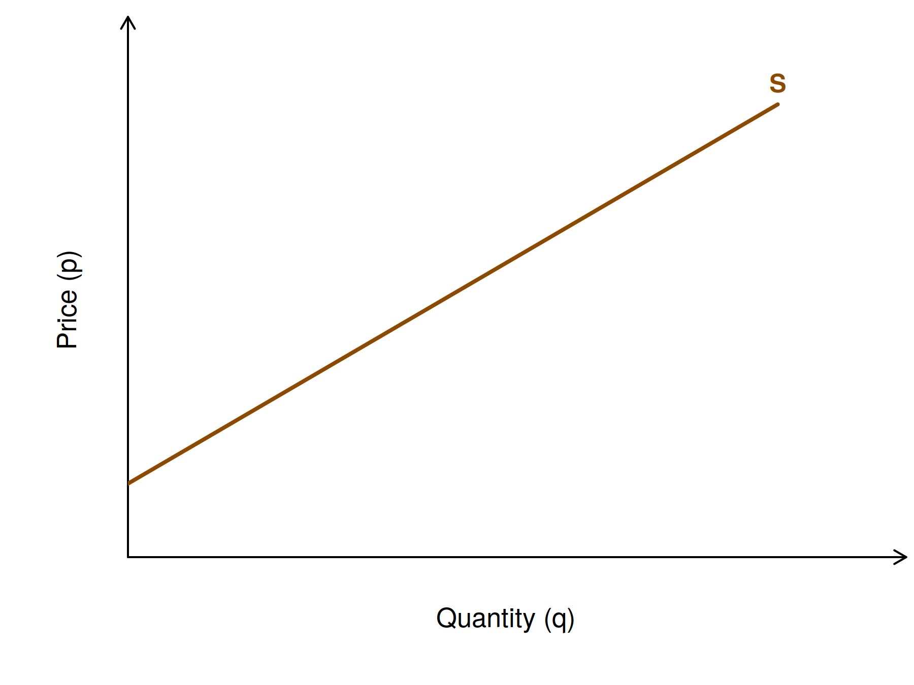{fig-alt="An upward-sloping supply curve S, with quantity (q) on the horizontal axis and price (p) on the vertical axis. No numbers on the axes." width="85%"}

*Explore: choose **Figure 1** in the [explorer](#explorer) above.*

The supply curve can shift horizontally along the x-axis: to the right (an increase in supply) or to the left (a decrease in supply).

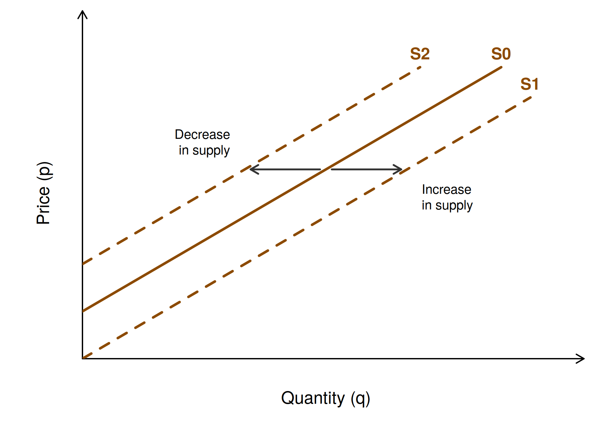{fig-alt="The original supply curve S0 and two dashed curves: S1, shifted to the right (increase in supply), and S2, shifted to the left (decrease in supply). Arrows show the direction of each shift." width="85%"}

*Explore: choose **Figure 2** in the [explorer](#explorer) above.*

In the competitive market case, the supply curve is the marginal cost (MC) curve. A profit-maximising firm produces up to the point where the revenue from one more unit (MR) equals its cost (MC); since a single firm cannot influence the price, MR = p\*, so it produces q\* where p\* = MC. The shaded area is the **total revenue (TR)**: q\* times p\*.

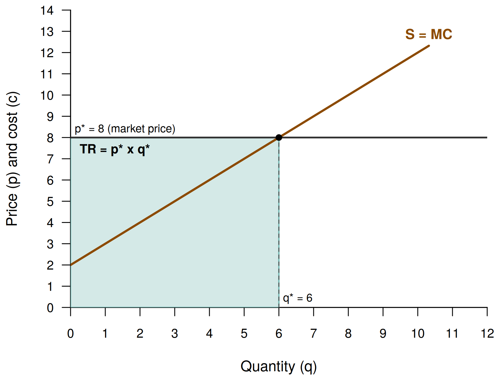{fig-alt="The supply curve S = MC (p = 2 + q) and a horizontal market price line at p* = 8. They cross at q* = 6. Total revenue TR = p* x q* is the shaded rectangle from 0 to 6 and from 0 to 8." width="85%"}

*Explore: choose **Figure 3** in the [explorer](#explorer) above.*

Total cost (TC) has two parts: total variable cost (TVC), which rises with the quantity produced, and fixed cost (FC), which does not: TC(q) = TVC(q) + FC. Fixed costs do not affect how much the firm produces, and the area under the MC curve adds up the cost of each additional unit, which is variable cost only. Figure 4 therefore shows TVC as the area under the MC curve from 0 to q\* (here 30).

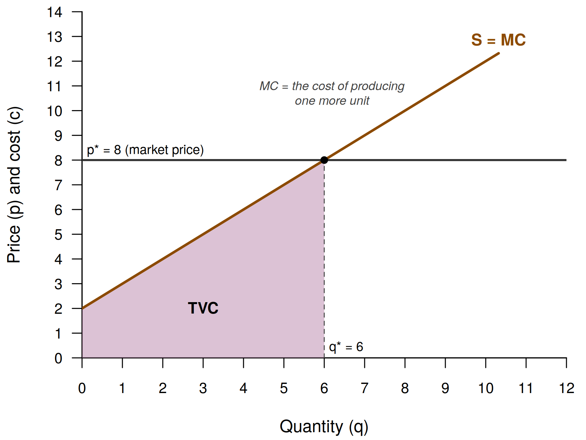{fig-alt="The supply curve S = MC and the price line p* = 8. The area under the MC curve from 0 to q* = 6 is shaded purple and labelled TVC. A note explains that MC is the cost of producing one more unit." width="85%"}

*Explore: choose **Figure 4** in the [explorer](#explorer) above.*

**Producer surplus** is total revenue (TR) minus total variable cost (TVC) at the aggregate level (Figure 5a), or the difference between the market price and the firms' marginal willingness to sell at the unit level (Figure 5b). Similar to profit, it measures the economic benefit that producers retain after netting out their variable costs.

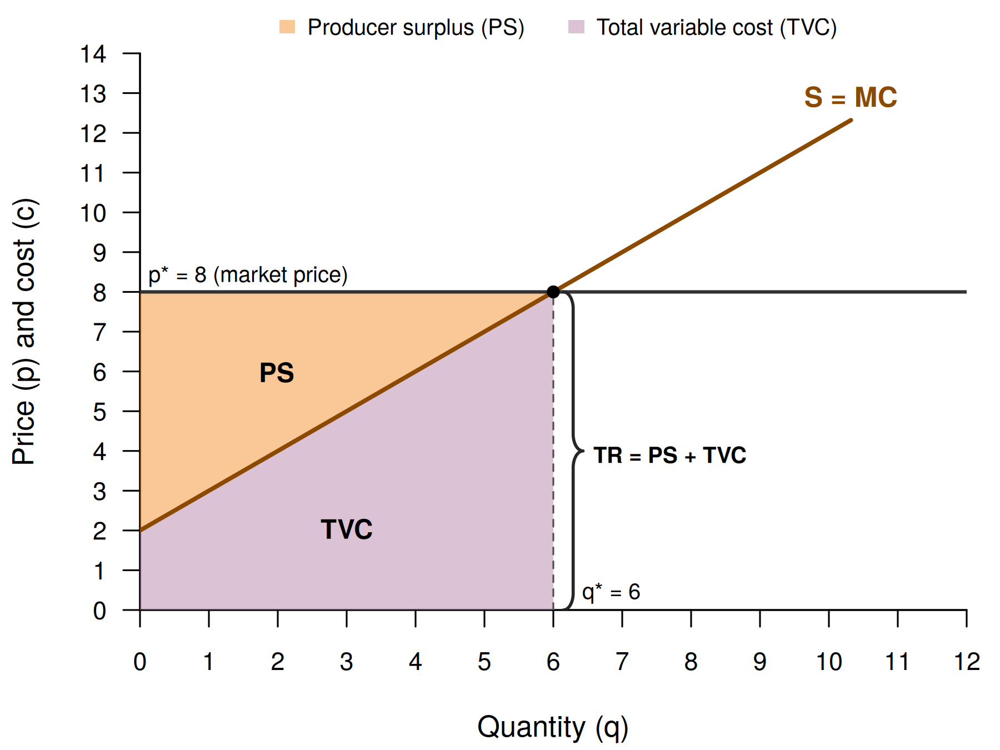{fig-alt="The rectangle of total revenue from 0 to q* = 6 and up to p* = 8 is split by the MC line: producer surplus PS (orange) above MC and total variable cost TVC (purple) below it. A brace on the right reads TR = PS + TVC." width="85%"}

*Explore: choose **Figure 5a** in the [explorer](#explorer) above; the slider "Quantity produced (q)" shows what happens when the firm produces more or less than q\*.*

Figure 5b looks at a single unit: on unit 3, the cost (its MC) is 5 and the surplus is p\* - MC = 8 - 5 = 3. Producer surplus is the sum of these surpluses on all units from 0 to q\*.

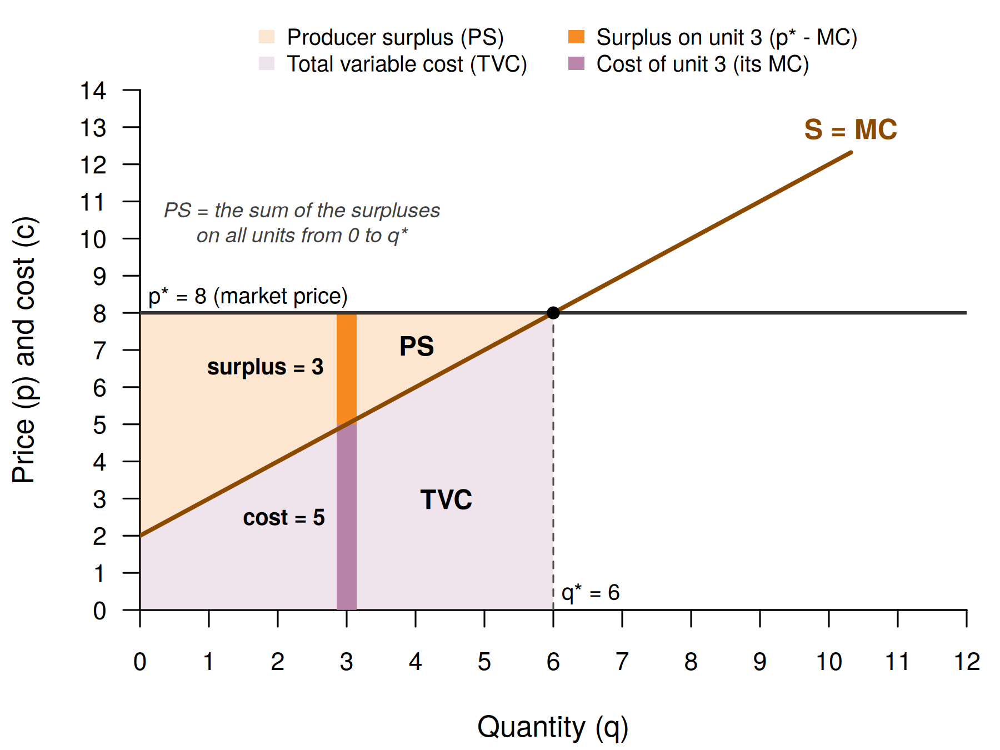{fig-alt="The same figure with lighter areas and a thin bar at unit 3: its lower part, up to the MC line, is the cost of the unit (5); its upper part, from MC up to p* = 8, is the surplus on that unit (3)." width="85%"}

*Explore: choose **Figure 5b** in the [explorer](#explorer) above.*

Are producer surplus and profit the same? Figure 6 uses a more realistic, U-shaped marginal cost curve: as output expands, MC first falls (e.g. because workers and machines are used more efficiently) and then rises (capacity constraints). Average variable cost (AVC = TVC/q) and average total cost (ATC = TC/q = AVC + FC/q) are added. The firm's supply curve is the part of the MC curve above the lowest AVC (the thick line): below that price, the firm cannot even cover its variable costs and stops producing. Figure 6a shows producer surplus as before, as the area between p\* and MC.

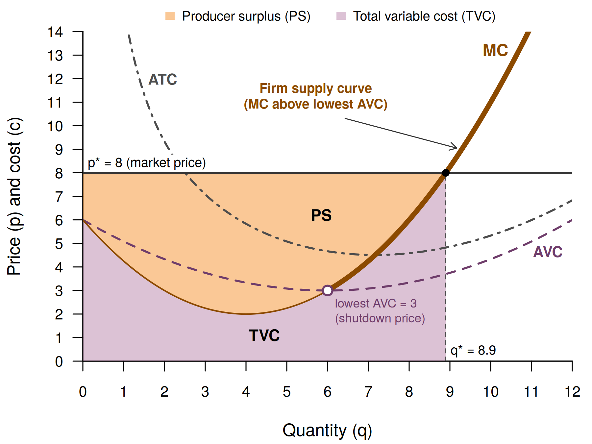{fig-alt="A U-shaped marginal cost curve with the average variable cost (AVC) and average total cost (ATC) curves. The thick part of MC above the lowest AVC (3, the shutdown price) is the firm supply curve. At p* = 8 the firm produces q* = 8.9; TVC (purple) lies under MC and PS (orange) between MC and the price line." width="85%"}

*Explore: choose **Figure 6a** in the [explorer](#explorer) above.*

Figure 6b splits total revenue into three rectangles: TVC (= AVC x q\*), fixed cost FC (= (ATC - AVC) x q\*), and profit (= (p\* - ATC) x q\*). Producer surplus is the sum of the top two: PS = profit + FC. The two figures show the same totals (TVC = 32.9, PS = 38.3) in different shapes: part of the area that is PS in Figure 6a lies inside the TVC rectangle in Figure 6b, and vice versa.

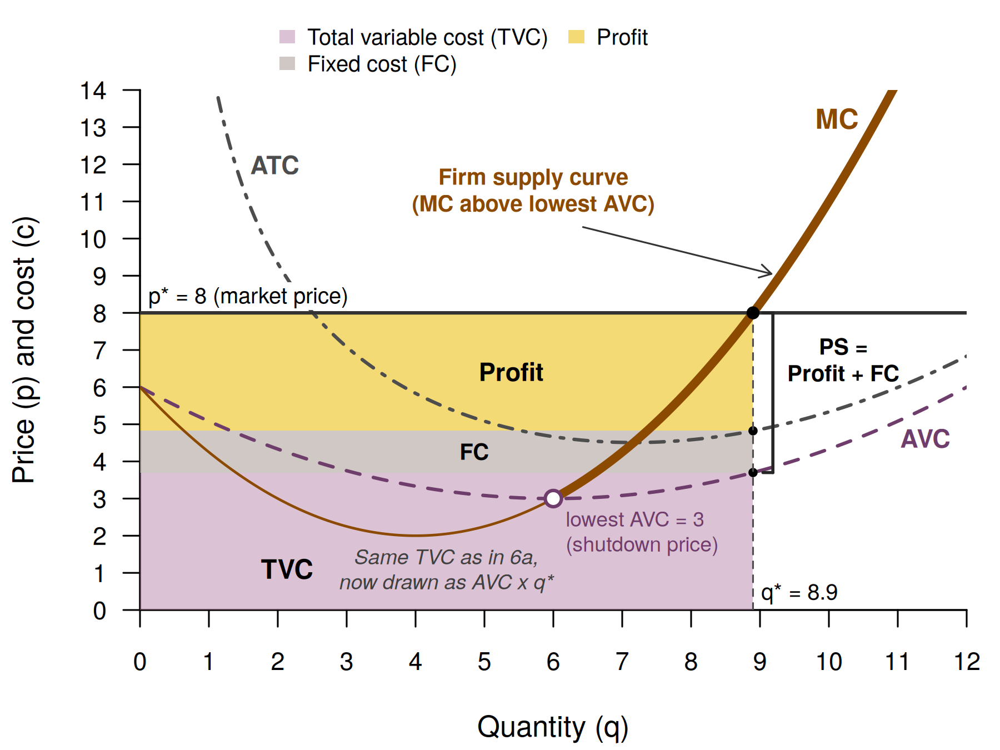{fig-alt="The same cost curves. Total revenue up to q* = 8.9 is split into three stacked rectangles: TVC (purple) up to AVC, fixed cost FC (grey) from AVC to ATC, and profit (yellow) from ATC to p* = 8. A bracket marks PS = Profit + FC." width="85%"}

*Explore: choose **Figure 6b** in the [explorer](#explorer) above.*

**Things to try in the explorer**

1. **Price and quantity.** In Figure 3, raise the market price p\* from 8 to 10. How much more does the firm produce, and how much does total revenue rise?
2. **Producing more or less than q\*.** In Figure 5a, move "Quantity produced (q)" above and below q\*. Which new area appears in each case, and what happens to profit in the table?
3. **Fixed costs.** In Figure 6b, raise the fixed cost FC from 10 to 30. Does q\* change? What happens to profit, and to producer surplus?

### B: The demand curve: buying

The demand curve shows, for every price, how much buyers as a group want to buy. It reflects buyers' willingness (and ability) to pay (W2P); other things being equal, the lower the price, the more buyers demand. Consumer surplus (CS) is the difference between what buyers would be willing to pay and what they actually pay (the blue area): on unit 3, the buyer would pay up to 11 but pays only 8, a surplus of 3. Adding up these surpluses over all units bought gives CS (here 18).

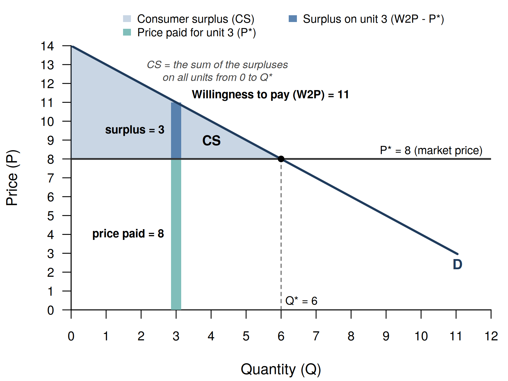{fig-alt="A downward-sloping demand curve D and the market price line P* = 8, crossing at Q* = 6. Consumer surplus is the light blue triangle above the price. A bar at unit 3 shows the price paid (8) and the surplus on that unit (3), adding up to the willingness to pay of 11." width="85%"}

*Explore: choose **Figure 7** in the [explorer](#explorer) above.*

**Things to try in the explorer**

1. **One buyer at a time.** In Figure 7, move "Unit to look at" from 3 to 6, then to 8. How does the surplus on that unit change? Is unit 8 bought at all?
2. **Keener buyers.** Raise the highest willingness to pay a from 14 to 16. What happens to consumer surplus? (The price P\* moves too: it comes from the market equilibrium in Figure 8.)

### C: Market equilibrium and excess

The intersection of the supply and the demand curve is the market equilibrium. At the equilibrium price P\*, the market clears: the quantity buyers want to buy equals the quantity sellers want to sell, Q\*. At this point, the price equals both the marginal cost of the last unit supplied and the marginal benefit of the last unit demanded: P\* = MC = MB.

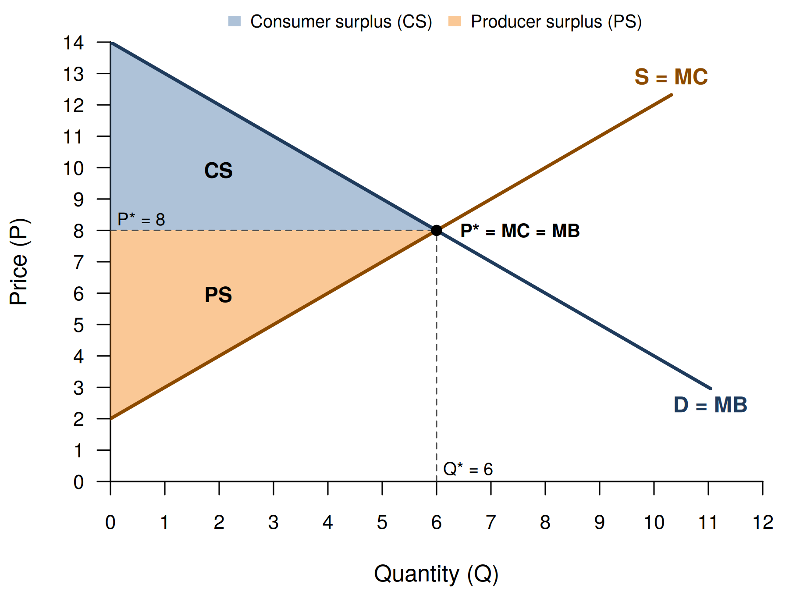{fig-alt="Supply S = MC and demand D = MB cross at P* = 8 and Q* = 6, where P* = MC = MB. Consumer surplus (blue) lies between the demand curve and the price, producer surplus (orange) between the price and the supply curve." width="85%"}

*Explore: choose **Figure 8** in the [explorer](#explorer) above.*

At any other price, the market does not clear. If the price is above P\*, sellers supply more than buyers demand: there is overproduction (excess supply, Figure 9).

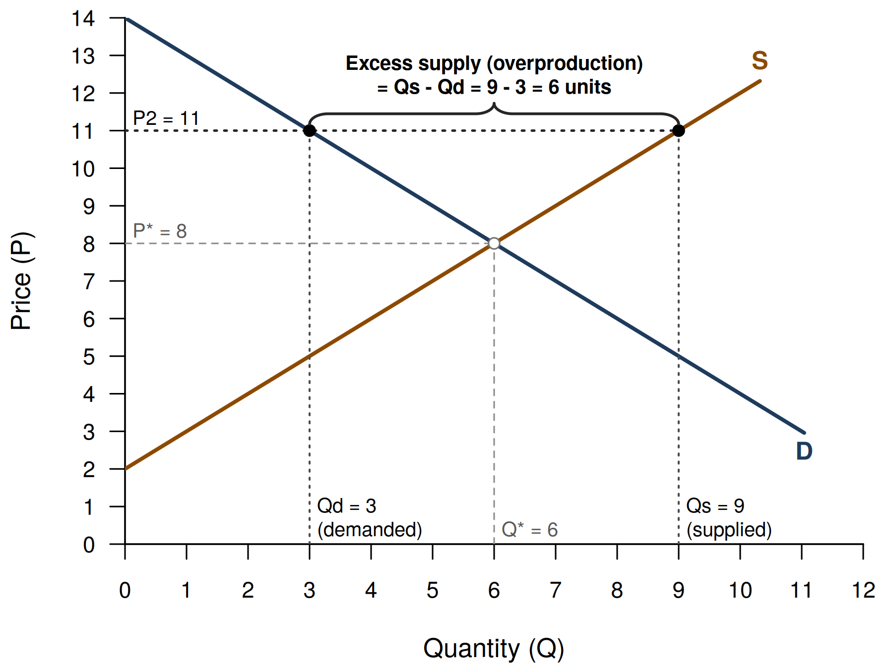{fig-alt="At a price P2 = 11 above the equilibrium price of 8, buyers demand Qd = 3 and sellers supply Qs = 9. A brace marks the excess supply of 6 units." width="85%"}

*Explore: choose **Figure 9** in the [explorer](#explorer) above.*

If the price is below P\*, buyers demand more than sellers supply: there is a shortage (excess demand, Figure 10).

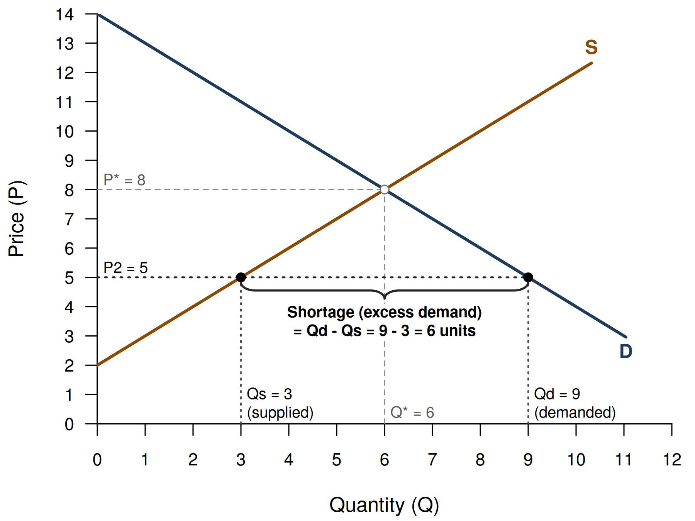{fig-alt="At a price P2 = 5 below the equilibrium price of 8, sellers supply Qs = 3 and buyers demand Qd = 9. A brace marks the shortage of 6 units." width="85%"}

*Explore: choose **Figure 10** in the [explorer](#explorer) above.*

**Things to try in the explorer**

1. **A cheaper technology.** In Figure 8, lower c (the cost of producing the first unit) from 2 to 0. How do P\*, Q\*, CS and PS change?
2. **Back to equilibrium.** In Figure 9, lower P2 from 11 to 8 in steps of 1. What happens to the excess supply? And when P2 falls below P\*?
3. **Steeper supply.** In Figure 10, raise d from 1 to 2. Is the shortage at P2 = 5 larger or smaller?

## Welfare

To get to total economic welfare, economists sum producer and consumer surplus as (proxy) measures for economic welfare. A welfare ledger is a social accounting table that sums up the different outcomes and effects into a net social benefit for society (Table 1).

| Group | Gains | Losses | Net gains |
|:------|:-----:|:------:|:---------:|
| Consumers | CS | | CS |
| Producers | PS | | PS |
| Government | | | 0 |
| External effects | | | 0 |
| **Society (net social benefit)** | | | **CS + PS** |

: Table 1: Social accounting ledger for the competitive market equilibrium (Figure 8)

*Note: In Figure 8, CS = PS = 18, so the net social benefit is 36. Government and external effects are zero because there is no intervention and, by assumption, no externalities; they become non-zero in later tutorials.*
